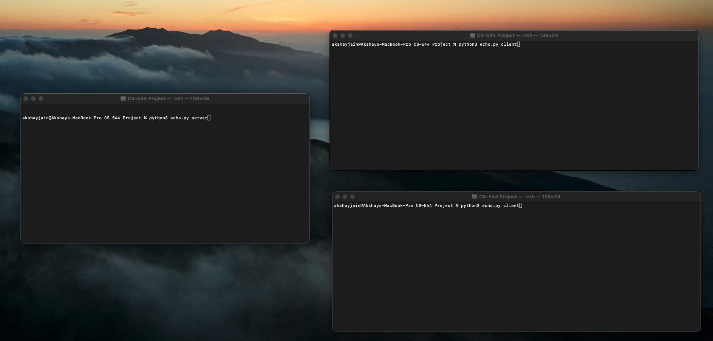
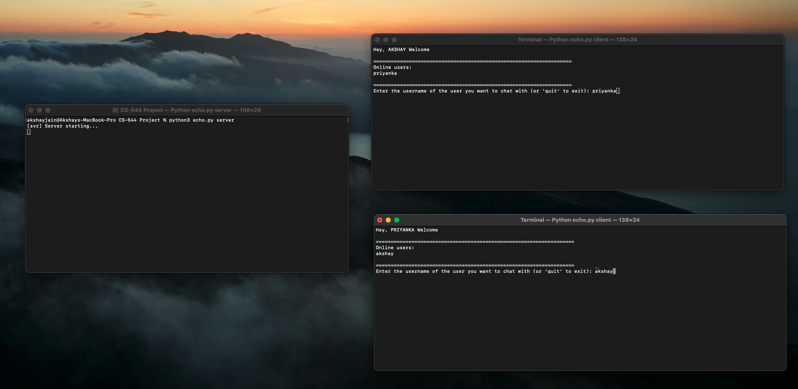
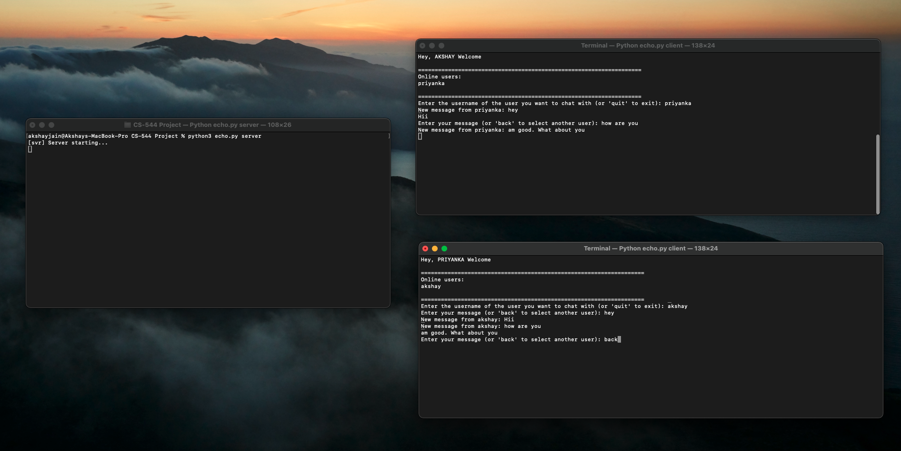
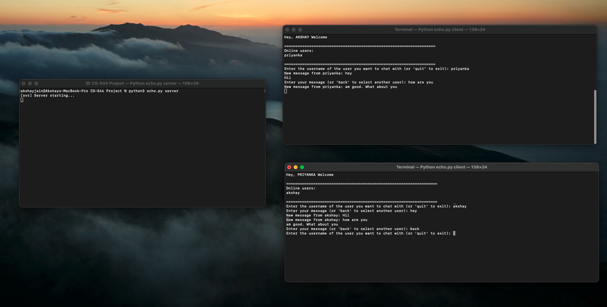
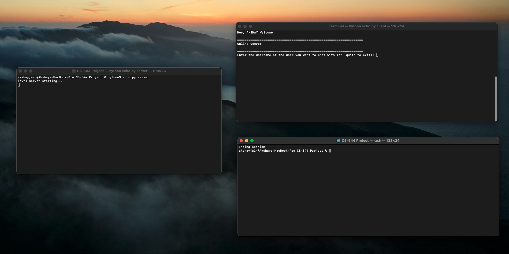

Quick Stream Chat Protocol (QSCP) is a communication protocol designed to facilitate real-time text-based interactions between users over the internet.

### Installation:-
Install dependencies using pip. You can use the provided requirements.txt file to install dependencies:
```sh
pip install -r requirements.txt
```
### Running the Application:-
1. Open 3 terminal windows and change directory to this project folder.
2. To start the server with default settings, run the following command 'python3 echo.py server'
3. In second and third terminal start client using 'python3 echo.py client'
4. In second and third window type random username and random password. Password checking is not enabled so any random text password will work.
5. In Second and Third window, Online participants list will be displayed.
6.  Select Participant by typing given username in both the windows.
7.  Now type messages in second and third terminal windows, message will be transmitted to other user.


### Extra tasks done:-
1. Implementation Robustness: Implemented robust error handling and edge case management.
2. Concurrent Server: Utilized concurrent handling using asyncio for improved scalability and performance.
3. Protocol Design Updates: Updated the protocol design based on practical implementation experience, ensuring compatibility and reliability.
4. I needed to update some of the PDUs in the original design. Updated original design document is also attached in folder "design".
5. Cloud-Based Git Repository: Managed the project using a cloud-based Git repository, enabling version control and collaboration. 

### Demo Screenshots
1. Running server and client code


2. Asking User to enter the username and password in client terminals.


3. Client displaying online participants list along with the welcome message.


4. Client to select the participant by typing online client's name to chat with.


5. Message being sent and received within the clients.


6. Client type back to end the chat with the current client.


7. Now if client want to chat with another online participants then they can chat with them.


8. If clients wants to quit the chat session then they can type quit.


9. When one of the client goes offline then the chat session ends.


